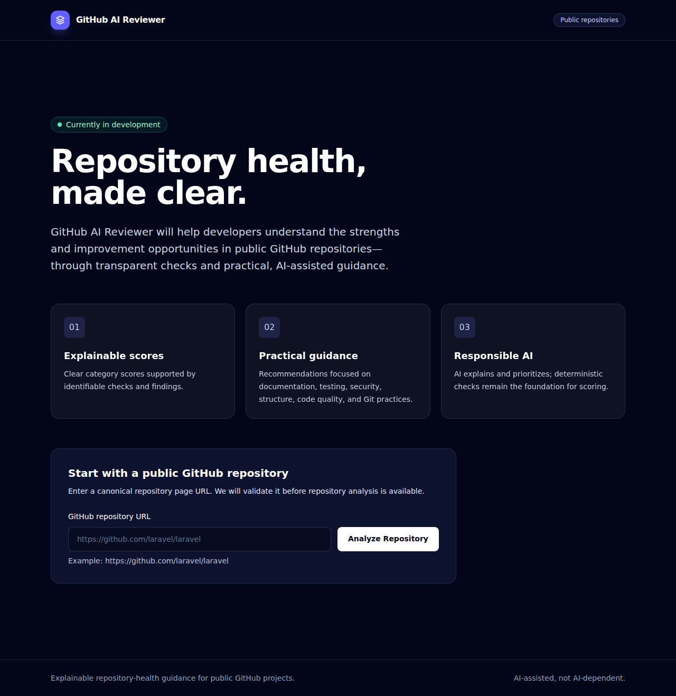
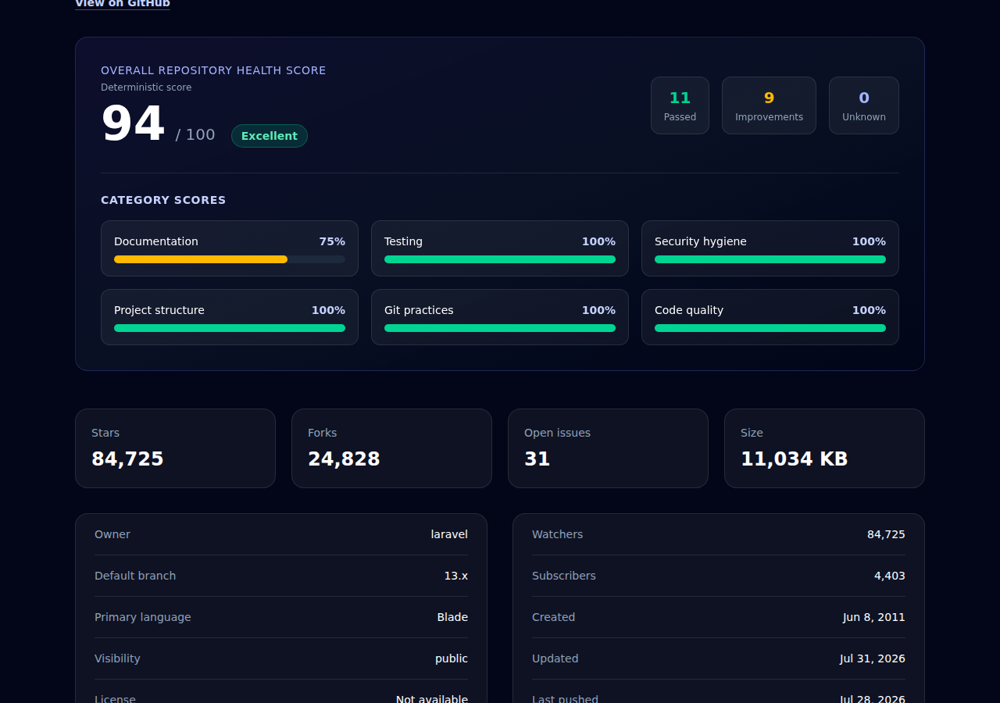
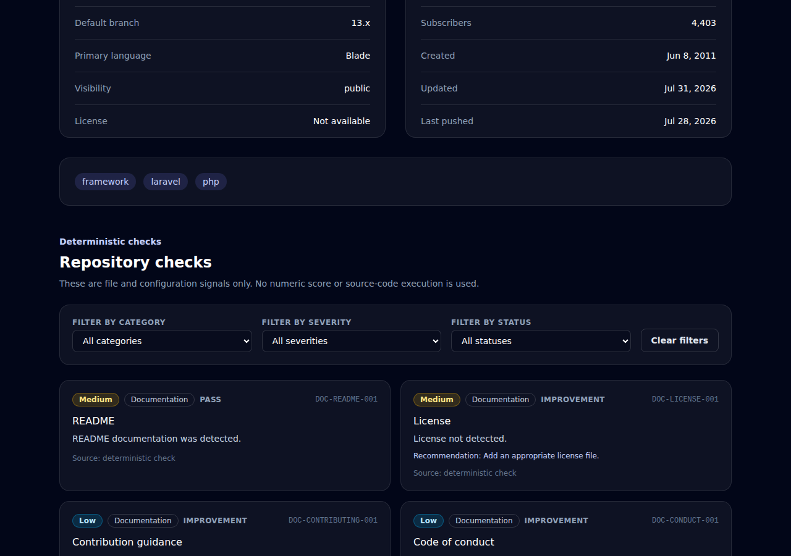
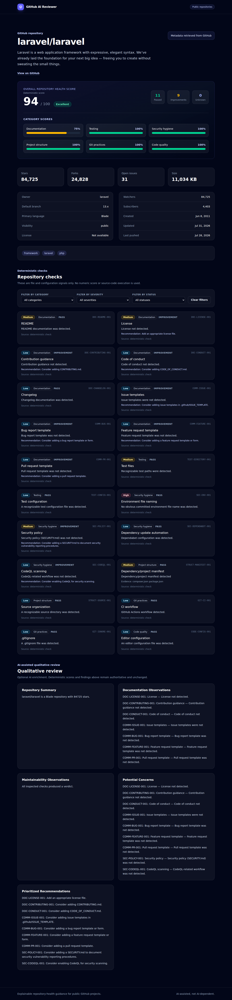
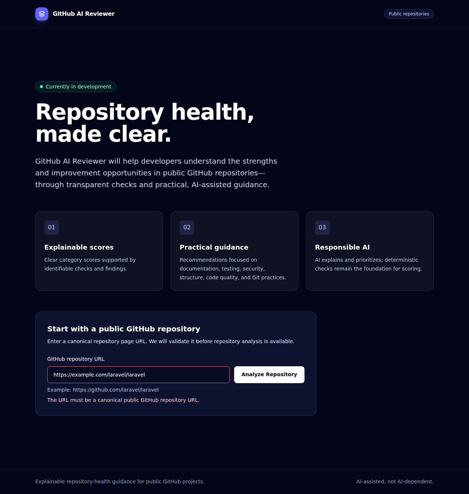
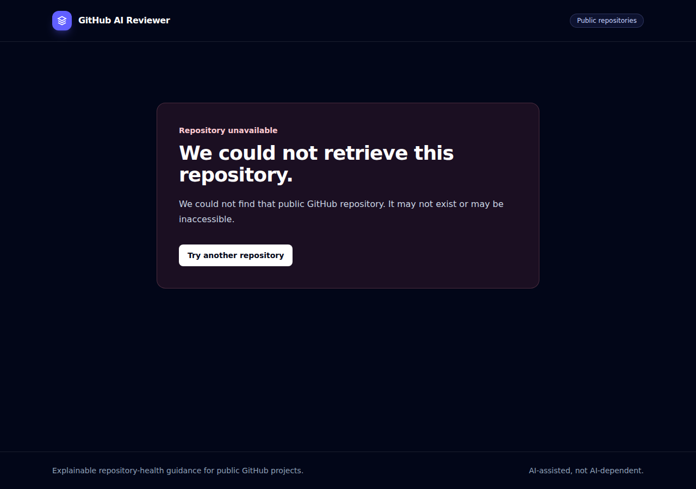

# Demo Report Walkthrough

This walkthrough uses public repository `https://github.com/laravel/laravel` with the **Fake AI Reviewer** backend. Screenshots use a local Playwright capture against GitHub's public API. No GitHub token or LLM request was used.

## Landing Page

The landing page explains score ownership and accepts a canonical public GitHub repository URL.

## Score Overview

Fixture run result:

- Overall health score: **94 / 100** — Excellent
- 11 passed, 9 improvements, 0 unknown
- Documentation: 75%
- Testing: 100%
- Security Hygiene: 100%
- Project Structure: 100%
- Git Practices: 100%
- Code Quality: 100%

The lower Documentation score comes from the fixture's missing changelog signal.

## Findings

The report shows typed, source-labelled findings. Status, category, and severity controls filter finding rows client-side.

## AI Enrichment

Fake AI provider output is deterministic demo enrichment. It summarizes selected deterministic findings and proposes recommendations; it does not alter score calculation or deterministic results.

## Invalid URL

Submitting `https://example.com/laravel/laravel` stays on the form and renders an inline validation error. No GitHub API call begins.

## Repository Unavailable

Submitting non-existent public URL `https://github.com/ZEFHANAA/repository-that-does-not-exist-2026` renders a friendly 404 page. No analysis is persisted and AI review is never invoked.

## Capture Environment

- Laravel 13, PHP 8.3+, SQLite
- `AI_PROVIDER=fake` (default)
- Playwright Chromium, 1280×900 viewport
- Public `laravel/laravel` GitHub API data, retrieved without a token

Reproduce locally with the app served against a temporary SQLite database and the Playwright flow used for this documentation.